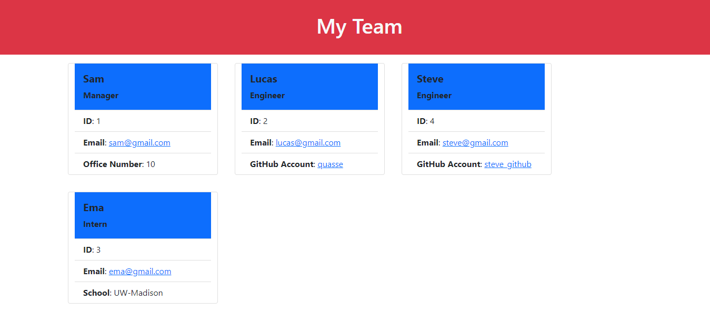

# Team Profile Generator

## Description

This application uses node.js to take in command line arguments to create an HTML file that displays members of a team and brief information about them. Using inquirer, the user first enters in the manager's name, id number, email and officer number and then can add an unlimited number of engineers and interns to the team.

Team members are displayed in cards using bootstrap. Each team member has a unique aspect. The engineer's card contains a link to a Github account, while the intern has a line about their school.

## Walkthrough

A link to a video file of me demonstrating this project can be found [here](https://drive.google.com/file/d/11xMumhQH4XwQK_Aehq0wLCRmlycRG0su/view).

## Screenshot

## Tests

To test, download or clone the project and then type "node index.js" from the root directory.

## Contributors

Made by Sam Morgen
